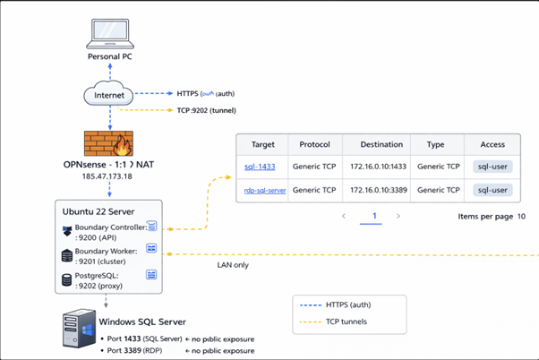
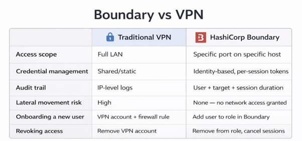

# 🔐 HashiCorp Boundary Zero Trust 

## 📌 Overview

This project demonstrates a **Zero Trust remote access architecture** built using:

- **HashiCorp Boundary**
- **OPNsense Firewall**
- **Ubuntu 22 Server** (Controller + Worker)
- **Windows SQL Server** (LAN only)

The objective was to securely provide remote access to:

- SQL Server (`1433`)
- RDP (`3389`)

Without exposing any internal services directly to the Internet.

---

## 🏗 Architecture

A personal workstation connects to Boundary over the Internet.

Boundary authenticates the user and establishes **per-session TCP tunnels** to internal services.  
Internal systems remain private and are never publicly exposed.

📎 See full architecture diagram:





---

## 🔐 Security Design

### 🌐 Publicly Exposed Ports

| Port | Purpose |
|------|----------|
| 9200 | Boundary Controller API |
| 9202 | Boundary Worker Proxy |

### 🚫 Blocked From Internet

- `1433` (SQL Server)
- `3389` (RDP)
- `9201` (Cluster communication port)

Only Boundary components are reachable from the Internet.  
All internal services remain accessible via authenticated sessions only.

This design enforces **Zero Trust principles** by:

- Eliminating direct network exposure
- Restricting access to specific ports
- Granting access per user, per session

---

## 🎯 Configured Targets

| Target Name      | Protocol     | Destination          |
|------------------|-------------|----------------------|
| `sql-1433`       | Generic TCP | 172.16.0.10:1433     |
| `rdp-sql-server` | Generic TCP | 172.16.0.10:3389     |

Access is granted using role-based permissions.

---

## 👤 Identity & Access Model

- Password-based authentication method
- Role-based access control
- Per-session authorization
- No direct LAN access granted

Users are authorized only to specific targets and ports.  
No full network access is ever provided.

---

## 🆚 Boundary vs Traditional VPN

See comparison table:



Unlike traditional VPN solutions, Boundary:

- Does not grant full LAN access
- Does not expose internal IP ranges
- Issues access on a per-session basis
- Provides detailed session auditing

---

## 🚀 How To Connect

### 1️⃣ Authenticate

```bash
boundary authenticate password
````

---

### 2️⃣ Start RDP Tunnel

```bash
boundary connect tcp -target-id <RDP_TARGET_ID>
```

Boundary will generate a local listening port, for example:

```
127.0.0.1:50708
```

---

### 3️⃣ Connect Using RDP Client

Connect to:

```
127.0.0.1:<generated_port>
```

The session is securely proxied through Boundary.

---

## 📚 What This Project Demonstrates

* Zero Trust architecture implementation
* Secure service exposure design
* Firewall hardening strategy
* Role-based access control
* Session-level auditing and tracking
* Identity-based infrastructure access

---

## 🔍 Key Takeaways

* Internal services can remain fully private.
* Access can be restricted to specific ports only.
* Lateral movement risk is eliminated.
* User onboarding and revocation become simple role operations.
* Audit visibility is improved compared to VPN-based access.

---

## 🛠 Possible Enhancements

* Add OIDC integration
* Enable session recording
* Move services to standard HTTPS port 443
* Add multi-worker architecture
* Integrate with HashiCorp Vault for credential brokering

---

## 🧠 Lessons Learned

* Correct port exposure is critical for Worker proxy communication.
* Role grants must include both `authorize-session` and `list` permissions.
* Scope awareness (Global vs Project) is essential in Boundary.
* Network troubleshooting should always verify actual listening ports.


---

## 📌 Author

Built as a hands-on Zero Trust lab to demonstrate secure infrastructure access using modern identity-based networking principles.
